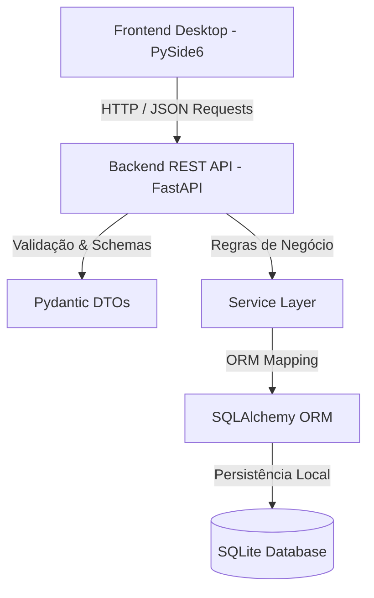

# 🕹️ GameRoomLog

<div align="center">


**Seu gerenciador pessoal de backlog de jogos, histórico de gameplay e anuário gamer definitivo.**

</div>

---

## 📖 Sobre o Projeto

O **GameRoomLog** é um aplicativo desktop nativo e moderno desenvolvido para gerenciar, catalogar e visualizar o seu histórico completo de jogos. Ele combina uma interface gráfica moderna e fluida construída em **PySide6 (Qt)** com a robustez e desacoplamento de uma **API REST em FastAPI**, tudo rodando localmente com altíssima performance.

---

## ✨ Funcionalidades Principais

- 🎮 **Game Room Visual:** Visão geral dos jogos que você está jogando agora, próximos na lista, fila de espera, zerados e platinados.
- 🔍 **Busca & Filtros Avançados:** Busca instantânea por título e painel retrátil de filtros em tempo real (Gênero, Desenvolvedora, Plataforma, Franquia e Tempo HLTB).
- 📅 **Anuário Gamer (Yearbook):** Estatísticas detalhadas por ano (horas jogadas, jogos finalizados, platinas conquistadas e médias de avaliação).
- ⚡ **Performance Zero-Stutter:** Cache inteligente em memória para capas (`QPixmap`), rolagem antecipada suave e carregamento sob demanda em lotes dinâmicos.
- 🏷️ **Gestão Completa de Categorias:** Organização por Plataformas, Gêneros, Desenvolvedoras e Franquias com autocompletar inteligente e auto-criação.
- 📦 **Importador do Notion:** Migre facilmente seu banco de dados anterior do Notion (CSV/Markdown) com detecção automática de capas e metadados.
- 🧪 **100% Testado:** Suíte com 36 testes automatizados (Backend, Mock de Frontend e Testes de Performance em milissegundos).

---

## 🏛️ Arquitetura do Software

O GameRoomLog utiliza uma **Arquitetura Client-Server Desacoplada**:



> **Pronto para Expansão:** Como o Frontend consome o Backend estritamente via API REST HTTP (`ApiClient`), o ecossistema está preparado para receber futuros clientes **Web (React/Vue)** ou **Mobile (Flutter/React Native)** sem necessidade de alterações no servidor.

---

## 🚀 Como Executar o Projeto

### Pré-requisitos
- **Python 3.11 ou superior** instalado ([python.org](https://www.python.org/downloads/)).
  - *No Windows:* Lembre-se de marcar a opção **"Add Python to PATH"** durante a instalação.
- **Git** instalado ([git-scm.com](https://git-scm.com/)).

---

### 1. Clonar o Repositório

```bash
git clone https://github.com/FabricioPereira008/GameRoomLog.git
cd GameRoomLog
```

---

### 2. Criar e Ativar o Ambiente Virtual

#### 🐧 No Linux / macOS:
```bash
python3 -m venv venv
source venv/bin/activate
```

#### 🪟 No Windows (PowerShell):
```powershell
python -m venv venv
.\venv\Scripts\Activate.ps1
```

> *Nota no Windows PowerShell:* Se receber um aviso de política de execução de scripts, execute antes: `Set-ExecutionPolicy -Scope CurrentUser RemoteSigned`

#### 🪟 No Windows (Prompt de Comando - CMD):
```cmd
python -m venv venv
venv\Scripts\activate.bat
```

---

### 3. Instalar as Dependências

```bash
pip install --upgrade pip
pip install -r backend/requirements.txt
pip install -r frontend_desktop/requirements.txt
```

---

### 4. Iniciar a Aplicação

#### Opção A: Inicializador Unificado (Recomendado)
Inicia o backend em segundo plano e a interface gráfica de uma só vez:
```bash
python desktop_launcher.py
```
*(Ou execute `python run_all.py`)*

#### Opção B: Modo de Desenvolvimento com Live Reload
Ideal para desenvolvimento (atualização de estilos `.qss` ao vivo e auto-restart):
```bash
python run_dev.py
```

#### Opção C: Terminais Separados
Se desejar inspecionar as requisições do servidor em tempo real:
```bash
# Terminal 1: Backend API
python backend/run_server.py

# Terminal 2: Frontend Desktop
python frontend_desktop/main_app.py
```

---

## 🧪 Testes Automatizados e Qualidade

O projeto possui cobertura completa com `pytest` (API, regras de negócio, mocks de rede e mutações de layout):

```bash
# Executar todos os testes
pytest -v

# Executar com relatório de cobertura de código
pytest --cov=backend/app --cov=frontend_desktop/api_client --cov-report=term-missing
```

### Hook de Pré-Commit
O repositório já inclui validação automática pré-commit (`.git/hooks/pre-commit`). Commits serão bloqueados automaticamente caso algum teste falhe.

---

## 📦 Gerar Pacotes Distribuíveis (AppImage e .EXE)

O projeto já conta com scripts prontos para empacotamento:

* **🐧 No Linux (AppImage):**
  ```bash
  ./scripts/build_appimage.sh
  ```
  *Gera:* `dist/GameRoomLog-x86_64.AppImage`

* **🪟 No Windows (.EXE / ZIP):**
  ```cmd
  scripts\build_windows.bat
  ```
  *Gera:* `dist\GameRoomLog-Windows-x64.zip`

---

## 📂 Estrutura de Diretórios

```text
GameRoomLog/
├── backend/                  # Servidor REST API (FastAPI)
│   ├── app/
│   │   ├── api/v1/          # Rotas e Endpoints HTTP
│   │   ├── core/            # Configurações e Banco SQLite
│   │   ├── models/          # Entidades SQLAlchemy
│   │   ├── schemas/         # Modelos Pydantic (Validação e DTOs)
│   │   └── services/        # Regras de Negócio e Serviços
│   ├── storage/covers/      # Armazenamento local de capas
│   └── tests/               # Testes automatizados do Backend
├── frontend_desktop/         # Interface Gráfica Desktop (PySide6)
│   ├── api_client/          # Cliente HTTP desacoplado
│   ├── styles/              # Folhas de estilo QSS (Dark Theme)
│   ├── views/               # Janelas, Componentes e Diálogos
│   └── tests/               # Testes de mutação de estado e layout
├── resources/                # Ícones e arquivo .desktop para Linux
├── scripts/                  # Scripts de build local (Linux e Windows)
├── .github/workflows/        # CI/CD automatizado no GitHub Actions
├── desktop_launcher.py       # Inicializador unificado para desktop
├── gameroomlog.spec          # Configuração de empacotamento PyInstaller
├── CHANGELOG.md              # Histórico de versões (Keep a Changelog)
├── pytest.ini                # Configuração do Pytest
└── run_all.py                # Inicializador conjunto para desenvolvimento
```

---

## 📄 Licença

Este projeto está sob a licença [MIT](LICENSE).
